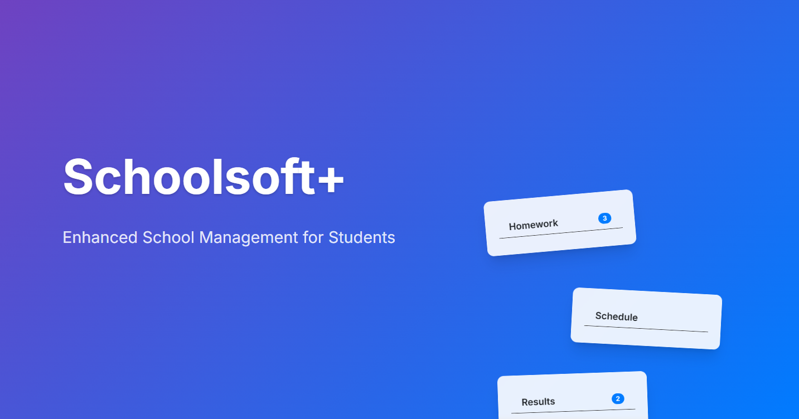

⚠️ **Maintenance Status**

This project is in **community-maintained** mode. While I'm no longer actively developing new features, I'm committed to managing contributions and partially addressing critical updates. Because it is built with vanilla HTML/CSS/JS, it is starting to get less and less supported by its dependencies (including Vercel), making it harder for me to keep updating it. Some features may need updates to align with Schoolsoft's recent changes.

**What you can expect:**
- Community contributions welcome
- Some critical bug fixes and maintenance
- ⚠️ Some features may require updates
- Feel free to fork and adapt for your needs

Feel free to contribute or use the code in your own projects (with credit).

[Project went open source in update 0.3.7]

---

<p align="center">
    <h1> Schoolsoft+</h1>
    <p>An enhanced alternative to Schoolsoft with modern UI, speed, and AI-powered features.</p>
    <a href="https://ssp.elias4044.com">https://ssp.elias4044.com</a>
    <br>
    <br>
    
    <!-- https://img.shields.io/badge/dynamic/json?url=https%3A%2F%2Fgithub.com%2Felias4044%2FSchoolsoftPlus%2Fraw%2Fmain%2Fpackage.json&query=%24.version&style=for-the-badge&label=VERSION
     -->
    
</p>

---

## 🌟 About Schoolsoft+
Schoolsoft+ is a **modern, fast, and sleek alternative to Schoolsoft**, designed to enhance your everyday school management experience.  
It integrates seamlessly with your existing Schoolsoft account while providing **enhanced UI, faster navigation**, and **smart AI features** for a smoother workflow.


---

## 🚀 Features
<div style="display:flex; flex-wrap:wrap; gap:15px; justify-content:center;">
<div style="background:#22c55e33; padding:12px 16px; border-radius:8px; min-width:180px; text-align:center;">
<strong>✨ Better UI</strong>
Clean, minimal, and user-friendly interface.
</div>

<div style="background:#3b82f633; padding:12px 16px; border-radius:8px; min-width:180px; text-align:center;">
<strong>⚡ Faster Navigation</strong>
Instant access to classes, grades, and schedules.
</div>

<div style="background:#f59e0b33; padding:12px 16px; border-radius:8px; min-width:180px; text-align:center;">
<strong>🤖 AI Integration</strong>
Smart suggestions, notifications, and insights.
</div>

<div style="background:#6366f133; padding:12px 16px; border-radius:8px; min-width:180px; text-align:center;">
<strong>📱 Fully Responsive</strong>
Desktop, tablet, and mobile friendly.
</div>

<div style="background:#ef444433; padding:12px 16px; border-radius:8px; min-width:180px; text-align:center;">
<strong>🎨 Customizable</strong>
Themes, layouts, and notifications tailored to you.
</div>

<div style="background:#10b98133; padding:12px 16px; border-radius:8px; min-width:180px; text-align:center;">
<strong>🔒 Secure</strong>
Your credentials are never stored on our servers.
</div>
</div>

---

## ⚡ Screenshots
<p align="center">
  
</p>

---

## 🛠 Local Development
To run Schoolsoft+ locally:

```bash
git clone https://github.com/elias4044/SchoolsoftPlus.git
cd SchoolsoftPlus
npm install
cp .env.example .env
````

Update `.env` with your local or test credentials as needed.

Start the local server:

```bash
vercel dev
```

Visit the provided URL (usually `http://localhost:3000`) to test locally.

---

## 📝 Usage

* Navigate and explore the app like the live site.
* Test AI features, navigation, and custom themes safely.
* Experiment freely—local changes do not affect Vercel deployment.

---

## 🤝 Contributing

We love contributions! Here's how you can help:

```bash
git checkout -b feature/my-feature
git commit -m "Add feature description"
git push origin feature/my-feature
```

Then open a Pull Request describing your changes.

**Tips:**

* Follow existing code style.
* Test features locally.
* Keep commits descriptive and clean.

---

## 💡 Support & Help

* **GitHub Issues:** [Open an issue](https://github.com/elias4044/SchoolsoftPlus/issues)
* **Contact:** `elias4044@proton.me`

---

## 📜 License

This project is licensed under the **MIT License**.
See [LICENSE](./LICENSE) for details.

---

<p align="center">
Made with ❤️ by <strong>Elias</strong> | Powered by <strong>Vercel</strong>
</p>